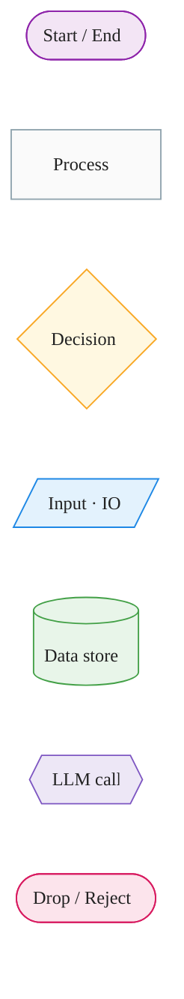
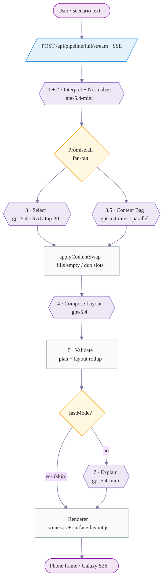
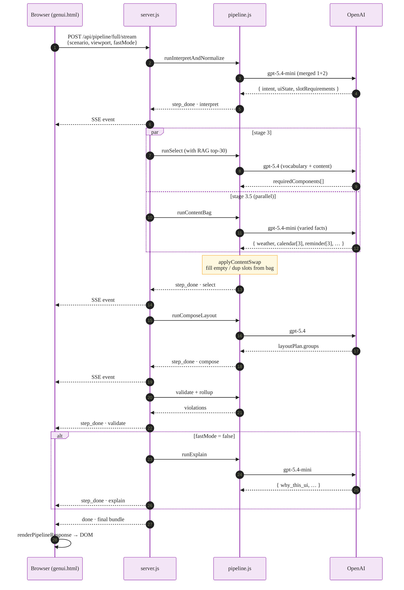
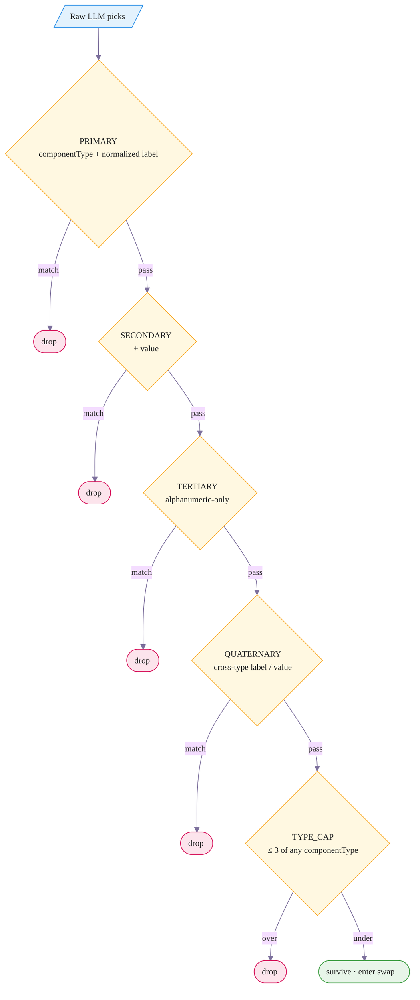
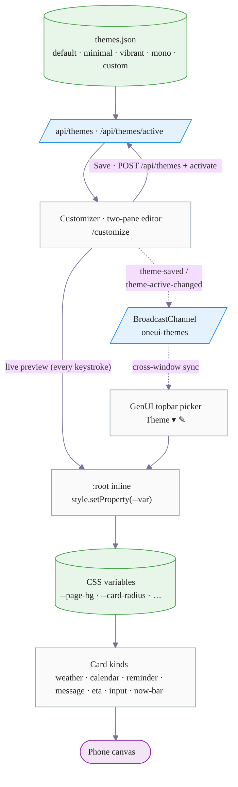
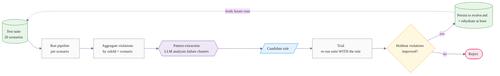

# Samsung One UI · GenUI

> A generative UI system for One UI 8.5: type a scenario in plain language,
> get a valid, themed, on-system Samsung screen rendered on a phone frame.

The whole loop runs through a 5-stage LLM pipeline with a parallel
content-enrichment side-call, an auto-iterating self-improvement engine,
and a theme system that swaps CSS variables in real time across windows.

---

## Diagram legend

All diagrams below share the same shape + color language, modeled on the
FigJam *Diagram Basics* template. Stay oriented by mapping shape →
role.



| Shape | Color | Role |
|---|---|---|
| Pill `( )` | lavender | Start / End — terminal nodes |
| Rectangle `[ ]` | cream | Process — deterministic step |
| Diamond `{ }` | pale yellow | Decision — branch with Yes/No |
| Parallelogram `[/ /]` | pale blue | Input / IO — data crossing a boundary |
| Cylinder `[( )]` | pale green | Data store — registry, embeddings, themes |
| Hexagon `{{ }}` | pale violet | LLM call — one OpenAI request |
| Pill (warm) | pale pink | Drop / Reject — duplicate or invalid |

---

## At a glance

End-to-end request flow. Every hexagon is one OpenAI call.



Stages 3 and 3.5 fire **in parallel**, so the content bag adds zero
critical-path latency. The bag (~5s) finishes well inside the
selector's window (~11s), and the swap pass uses its output to fill
empty or duplicated slots before composition.

---

## The 5-stage pipeline

| # | Stage | Model | Input | Output | Why it exists |
|---|-------|-------|-------|--------|---------------|
| 1+2 | `runInterpretAndNormalize` | mini | scenario text | `interpretation` + `planningPacket` (uiState, tasks, slot_requirements) | Strip prose into structured intent so the selector has something machine-readable |
| 3 | `runSelect` | full | planningPacket + RAG shortlist | `plan.requiredComponents[]` (componentType, role, slot, content) | Pick concrete components from a vocabulary of 92 (filtered to 52 renderable, top-30 by embedding) |
| 3.5 | `runContentBag` | mini | scenario + uiState hints | unique-label fact bundle keyed by component type (weather, calendar, reminder × 3, message × 3, eta, …) | Material to fill empty / duplicated slots — runs in parallel with stage 3 |
| 4 | `runComposeLayout` | full | plan | `layoutPlan.groups[].children[]` (vertical-stack / horizontal-stack / grid) | Spatial reasoning + reference-layout matching + token alignment |
| 5 | `validatePlan` + `validateLayout` | — | plan + layoutPlan | `violations[]` rolled up by severity | 17+ rules: vocabulary, ordering, overflow, attention budget, role coherence |
| 7 | `runExplain` | mini | everything | `{ why_this_ui, what_was_prioritized, what_was_removed, what_should_be_fixed }` | Human-readable rationale for the panel beside the canvas |

**Per-stage routing** keeps cost down — heavy reasoning stays on `gpt-5.4`,
mechanical extraction lives on `gpt-5.4-mini`. Configurable in
`.env` (`OPENAI_MODEL`, `OPENAI_MODEL_FAST`, `OPENAI_MODEL_COMPOSE`,
`OPENAI_MODEL_EXPLAIN`, `OPENAI_MODEL_CONTENT_BAG`).

### Request flow (with parallelization)



---

## RAG vocabulary funnel

The component registry has 92 entries. Pasting all of them into every
selector prompt would be wasteful and pollute the LLM's choice space
with components that don't even have a renderer.

```mermaid
%%{init: {'theme':'base', 'themeVariables': {
  'fontFamily':'ui-sans-serif, system-ui, sans-serif',
  'fontSize':'13px',
  'lineColor':'#7C6F9C'
}}}%%
flowchart LR
  reg[(Registry · 92 components)]:::data
  flt[Filter to renderable<br/>RENDERABLE_COMPONENT_IDS]:::proc
  rendered[(52 renderable IDs)]:::data
  embed[/Cosine top-K<br/>vs scenario embedding/]:::io
  top[(Top 30)]:::data
  mand[+ surface-mandatory<br/>status-bar · header]:::proc
  shortlist[(31–32 final shortlist)]:::data
  sel{{Stage 3 · Selector prompt}}:::llm

  reg --> flt --> rendered --> embed --> top --> mand --> shortlist --> sel

  classDef proc  fill:#FAFAFA,stroke:#90A4AE,color:#212121
  classDef io    fill:#E3F2FD,stroke:#1E88E5,color:#212121
  classDef data  fill:#E8F5E9,stroke:#43A047,color:#212121
  classDef llm   fill:#EDE7F6,stroke:#7E57C2,color:#212121
```



The 40 components dropped by the renderable filter (e.g.
`card.subheading`, `card.menu-item-body`, `dialog.browser-top-bar`)
exist in the registry but the renderer has no template for them — they
would fall through to `(no template registered)` placeholder cards and
trip multiple validators. Filtering at the embedding stage makes the
selector physically incapable of picking a non-renderable id.

**Source of truth for the renderable set** — four maps that must stay
in sync:

| Map | File | Role |
|---|---|---|
| `templates` | `app/templates.js` | 28 editor-primitive templates (`card`, `dialog`, `bottomnav`, …) |
| `PIPELINE_FALLBACK_TEMPLATES` | `app/templates.js` | 10 card-style fallback renders (`weather_glance_card`, `eta_card`, …) |
| `PIPELINE_CHROME_ATOMIC_ROLE` | `app/scenes.js` | 6 chrome IDs → atomic roles (status-bar, header, gesture-bar) |
| `PIPELINE_BODY_ATOMIC_ROLE` | `app/scenes.js` | 19 body IDs → atomic roles (focus-block, now-bar, action-row) |

Their union (52 IDs) is `RENDERABLE_COMPONENT_IDS` in `pipeline.js`.

---

## Diversity rules + 4-tier dedup ladder

The selector LLM, left alone, will happily emit "STEP 2 OF 7 · Sauté
tofu …" three times in a row. We catch that at four levels — each
tier loosens the matching criterion until even cross-componentType
duplicates get pruned.



Most duplicates die at PRIMARY. The cross-type tier is the safety
net for `btn-contained "Coupang cart"` + `action_chip_row "Coupang
cart"` style collisions where the label is identical but the
componentType differs.

The **selector prompt** also bakes in upstream diversity rules: max 2
of the same componentType, every label must be unique, prefer variety,
and `input_summary_card` is reserved for form summaries (not a generic
content card).

---

## Per-slot content resolution

A subtle renderer trap: the old `contentByType` Map keyed by
componentType only — so when the plan has 3 distinct
`input_summary_card` entries with different content (e.g. "Cooking
session", "Recipe", "Step 3 of 7"), `Map.set` overwrote each previous
entry, and all 3 layout children rendered with the **last** entry's
content. The screen looked like 3 identical step cards.

The fix is a 3-tier resolver:

```mermaid
%%{init: {'theme':'base', 'themeVariables': {
  'fontFamily':'ui-sans-serif, system-ui, sans-serif',
  'fontSize':'13px',
  'lineColor':'#7C6F9C'
}}}%%
flowchart LR
  child[/Layout child<br/>{componentId, slot}/]:::io
  child --> r1{contentBySlot[slot]?}:::dec
  r1 -- hit --> done([use this content]):::pass
  r1 -- miss --> r2{contentByTypeQueue[type].shift?}:::dec
  r2 -- hit --> done
  r2 -- miss --> r3[contentByType<br/>legacy last-wins]:::proc
  r3 --> done

  classDef io    fill:#E3F2FD,stroke:#1E88E5,color:#212121
  classDef dec   fill:#FFF8E1,stroke:#F9A825,color:#212121
  classDef proc  fill:#FAFAFA,stroke:#90A4AE,color:#212121
  classDef pass  fill:#E8F5E9,stroke:#43A047,color:#212121
```

Distinct slots get their own content; identical-type-different-content
plan entries are handed out in plan order via the queue. Last-wins
remains as a final fallback so missing slots still render *something*
rather than crash.

---

## Layout composer post-fixes

The composer LLM produces a layout, then a deterministic chain of
post-processors adjusts it before validation:

| Post-fix | What it does |
|---|---|
| `chrome-role correction` | LLM sometimes tags content components as `role: "chrome"` — demoted to subject/state/context |
| `same-label dedup` | 4-tier ladder above |
| `type-cap` | Hard ceiling of 3 per componentType |
| `mandatory injection` | Surface-required IDs (status-bar, header for `app`) added if the LLM didn't pick them |
| `context-aware injection` | Morning scenarios → calendar, etc. |
| `role-based child reorder` | Each group sorted subject → state → context → action → feedback |
| `auto-grid (tile whitelist)` | If a group has 3+ same-type children AND the type is in `GRID_FRIENDLY_IDS` (weather / qs-toggle / widget-small / shortcut / buttons), promote container → 2-col grid. Text-heavy cards stay vertical-stack. |
| `composer backfill` | If composer dropped plan components, append them to the appropriate group |
| `chrome migration` | Move non-chrome components out of chrome groups |

**Chrome exemption** in the validators — `validateLayoutOverflow`
skips width / visibleChildren checks for any child whose
`role === 'chrome'` or whose parent group is `role === 'chrome'`.
Chrome is full-width by design and doesn't compete for the user's
attention budget; flagging it was a false positive that produced 1–2
noise violations every run.

---

## Theme system



**Live preview is real-time.** `_writeVar(key, value)` writes to
`document.documentElement.style.setProperty` on every input event. CSS
variables propagate immediately to all consumers; the preview grid
re-renders on the same tick. The **Save** button is the only
persistence step — it POSTs the new theme and atomically broadcasts
`theme-active-changed` to other open windows so the GenUI main app's
topbar picker updates without a manual refresh.

Theme transitions across the page chrome animate over 280ms
`cubic-bezier(0.2, 0, 0, 1)` for color / background / border / shadow
— limited to non-layout properties so there's no reflow.
`prefers-reduced-motion` skips the animation.

---

## Self-improving loop

20 test scenarios (15 train + 5 holdout) live in
`figma-refs/test_scenarios.json`. The improvement engine runs the
suite, asks an LLM to extract patterns from the violations, trials a
candidate rule against the scenarios, and persists the rule only if
holdout violations actually drop.



Boot output shows `Improve test-suite 20 scenarios · N learned rules
rehydrated`. Cycle history snapshots are persisted under
`data/improvement_history/`. Dashboard at `/improve`.

---

## API surface

| Endpoint | Method | Purpose |
|---|---|---|
| `/api/pipeline/full` | POST | Single-shot, returns full bundle |
| `/api/pipeline/full/stream` | POST | SSE — emits `step_started` / `step_done` per stage (used by the UI for progressive render) |
| `/api/pipeline/plan` | POST | Stages 1–3 only |
| `/api/pipeline/compose` | POST | Stages 1–4 |
| `/api/themes` | GET / POST | List themes / save a custom theme |
| `/api/themes/active` | POST | Set the active theme id |
| `/api/improve/test-suite` | GET | List the 20 scenarios |
| `/api/improve/extract` | POST | Run pattern extraction on current violations |
| `/api/improve/trial` | POST | Trial a candidate rule on the suite |
| `/api/improve/cycle` | POST | Full cycle (extract → trial → persist) |
| `/api/agent/health` | GET | Server health + model name |

---

## File map

| Layer | File | Role |
|---|---|---|
| **Server** | `server.js` | HTTP, routing, OpenAI calls, per-stage model routing, embeddings, theme + improve endpoints |
| | `pipeline.js` | The 5 stages, RAG shortlist, content bag, dedup ladder, type cap, post-fixes, validators |
| | `layout_composer.js` | `validateLayoutOverflow` + `validateContextComponentMatch` (chrome-exempt width / visibleChildren checks) |
| | `schema_normalizer.js` | Defensive schema reconciliation (LLM emits camel↔snake variants) |
| | `improvement_engine.js` | Test runner + pattern extractor + trial harness + persist |
| | `generator.js` | Local-mode keyword matcher (legacy fallback) |
| **Client (UI shell)** | `genui.html` | Sidebar tabs (Generate / Design / Refine / Wallpaper / Motion), topbar (Theme / Light / Device / Clear), canvas frame |
| | `customize.html` | Two-pane theme editor + live preview + Save / Discard |
| | `improve.html` | Self-improvement cycle dashboard |
| | `index.html` | Project landing — links to genui / customize / improve / preview |
| **Client (renderer)** | `app/scenes.js` | `renderPipelineResponse` orchestrator, per-slot content resolver, focus-block / now-bar / action-row adapters, kind parsers |
| | `app/surface-layout.js` | Atomic shapes: status bar, app bar, gesture bar, focus block, now bar, action row, list item, dialog, etc. |
| | `app/templates.js` | Editor-primitive templates + `PIPELINE_FALLBACK_TEMPLATES` |
| | `app/agent.js` | Path-A pipeline client (SSE consumer) + auto-iterate loop |
| | `app/canvas.js` | `clearCanvas` + DesignDoc reset |
| | `app/settings.js` | Light/Dark canvas toggle, applyColor walker |
| **Knowledge base** | `figma-refs/component_registry.json` | 92 component specs (variants, layout_spec, allowed_contexts) |
| | `figma-refs/component_embeddings.json` | 1536-dim embeddings for RAG (text-embedding-3-small) |
| | `figma-refs/themes.json` | Theme presets + `_active` id |
| | `figma-refs/test_scenarios.json` | 20 scenarios for the improvement engine |
| | `figma-refs/generator_memory.json` | Mandatory components per surface, layout reference orders |
| | `figma-refs/design_rules.json` | Token families |
| | `DESIGN.md` / `GENUI.md` / `ORCH.md` | Knowledge base for `buildPromptContext` to slice into prompts |
| | `evolve.md` | Persisted learned constraints from the self-improvement engine |
| **Build** | `scripts/build_component_embeddings.js` | Regenerates the RAG corpus from `component_registry.json` |
| **State** | `data/improvement_history/*.json` | Snapshots of past improvement cycles |

---

## Local dev

```bash
# 1. Set your key + per-stage model routing
echo 'OPENAI_API_KEY=sk-...'              >  .env
echo 'PIPELINE_RAG=on'                    >> .env
echo 'OPENAI_MODEL=gpt-5.4'               >> .env
echo 'OPENAI_MODEL_FAST=gpt-5.4'          >> .env
echo 'OPENAI_MODEL_COMPOSE=gpt-5.4'       >> .env
echo 'OPENAI_MODEL_EXPLAIN=gpt-5.4-mini'  >> .env
echo 'OPENAI_MODEL_CONTENT_BAG=gpt-5.4-mini' >> .env

# 2. Run
node server.js
# → http://127.0.0.1:3001
```

Boot banner reflects model routing, RAG status, suite size, and how
many learned rules were rehydrated:

```
✓ Running on  http://127.0.0.1:3001  (loopback-only)
✓ Model       gpt-5.4   (select)
✓ Model EXPL  gpt-5.4-mini  (explain)
✓ Model BAG   gpt-5.4-mini  (stage 3.5 content bag, parallel)
✓ Stage 3 RAG ON  (top-30 from 92, +~400ms/call)
✓ Improve     test-suite 20 scenarios · 0 learned rules rehydrated → POST /api/improve/cycle
✓ Limits      body<=1024KB  llm<=4 concurrent / 60 per min
```

---

## Topbar UX

```
┌────────────────────────────────────────────────────────────────────┐
│ ⌂  SAMSUNG GenUI    [Theme ▾ ✎] [Light]   [📱 Galaxy S26 ▾]  [Clear] │
└────────────────────────────────────────────────────────────────────┘
```

Grouped left → right by purpose: **Look** (theme + canvas mode) →
**Device** → **Action**. Theme picker lives in the topbar (not the
Generate panel) because it's a global preference, not a per-generate
option. The ✎ icon opens `/customize` in a new window with
BroadcastChannel sync.

---

## One UI design tokens (reference)

This is still a One UI 8.5 design system at heart — the generative
pipeline produces UIs that respect these tokens.

### Color
| Token | Light | Dark | Use |
|---|---|---|---|
| Primary | `#0381FE` | `#0381FE` | FAB, sliders, accent |
| Primary Dark | `#0072DE` | `#3E91FF` | Contained buttons |
| Activated | `#3E91FF` | `#3E91FF` | Checkboxes, toggles |
| Surface | `#FCFCFC` | `#171717` | Page background |
| Text Primary | `#252525` | `#FAFAFA` | Body text |
| Divider | `#E4E4E4` | `#47E4E4E4` | Borders |

### Radius
| Token | Value | Use |
|---|---|---|
| Checkbox | 4dp | Small controls |
| List item | 8dp | Item backgrounds |
| Bottom nav | 12dp | Nav buttons |
| Switch | 16dp | Toggle track |
| Button | 18dp | All buttons |
| Chip | 22dp | Tags, filters |
| Card / Dialog / Sheet | 26dp | Containers |
| FAB | 50% | Floating action |
| Search / Pill | 999dp | Search bars |

### Motion
| Token | Curve / Duration | Use |
|---|---|---|
| `ease-emphasized` | `(0.2, 0, 0, 1)` | Hero transitions, sheets |
| `ease-spring` | `(0.2, 0.6, 0.4, 1)` | Dialogs, FAB, scale |
| `ease-bounce` | `(0.34, 1.56, 0.64, 1)` | Celebration, success |
| `dur-normal` | 300ms | Standard transitions |
| `dur-slow` | 400ms | Bottom sheets, dialogs |
| `dur-page` | 800ms | Page transitions |

---

## Diagram style notes

Diagrams above use a shape + color language ported from FigJam's
*Diagram Basics* template:

- **Pill (lavender)** for terminal nodes (Start / End / Phone canvas)
- **Rectangle (cream)** for deterministic processes
- **Diamond (pale yellow)** for decisions — Yes / No / Success branches
- **Parallelogram (pale blue)** for I/O — data crossing a boundary
- **Cylinder (pale green)** for data stores (registry, embeddings, themes)
- **Hexagon (pale violet)** for LLM calls — emphasizes "AI thinks here"
- **Pill (warm pink)** for drops / rejects — duplicate or invalid

GitHub renders Mermaid natively, so the diagrams are first-class
content on the repo landing page.

---

## Source references

- [Samsung Korea](https://www.samsung.com/sec/) · [Samsung US](https://www.samsung.com/us/)
- [Samsung Brand Identity](https://www.samsung.com/sec/about-us/brand-identity/)
- [One UI Design System](https://design.samsung.com/global/contents/one-ui/)
- [One UI Developer Docs](https://developer.samsung.com/one-ui)
- [oneui-design (GitHub)](https://github.com/OneUIProject/oneui-design)
- [FigJam · Diagram Basics (template)](https://www.figma.com/board/4OPGrPb6iawIeZtqbFizBQ/Diagram-Basics--Community-) — diagram shape/color language
